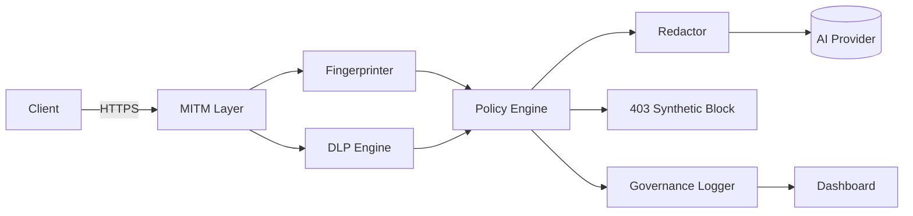

# Shadow AI Discovery & Governance Proxy — Architecture

## Goals
- Discover and classify outbound AI traffic.
- Inspect prompts for PII/secrets (synthetic only).
- Redact, mask, or block risky content.
- Log governance events and surface them via a dashboard.

## High-Level Diagram (Mermaid)

## Components
- **MITM Layer (`proxy/mitm_layer.py`)**: synthetic root CA, optional proxy.py plugin for TLS interception and handshake logging.
- **Fingerprinter (`proxy/fingerprinter.py`)**: heuristic matching on domains, paths, headers, and optional TLS JA3 hints to classify AI providers.
- **DLP Engine (`proxy/dlp_engine.py`)**: regex + entropy + optional spaCy NER to detect PII/secrets; outputs scores and segments.
- **Policy Engine (`proxy/policy_engine.py`)**: enterprise-style rules (no PII, redact secrets, block unapproved LLMs, safe-mode rewrite).
- **Redactor (`proxy/redactor.py`)**: redact, mask, rewrite, or block based on policy; consistent tokens for PII/secret placeholders.
- **Governance Logger (`proxy/governance_logger.py`)**: JSONL/CSV logging with session/service/model/policy/risk metadata.
- **Dashboard (`dashboard/`)**: React + Vite UI; synthetic WebSocket-like feed to visualize violations, heatmap, and redaction logs.
- **Tests (`tests/`)**: synthetic scenarios for DLP, fingerprinting, and policy/redaction flow.

## Data Flow
1. MITM receives a request, extracts host/path/headers/body.
2. Fingerprinter guesses the AI provider.
3. DLP analyzes prompt text for PII/secrets.
4. Policy decides allow/redact/mask/rewrite/block.
5. Redactor transforms prompt if needed; blocker returns synthetic 403.
6. Governance Logger records the event; dashboard ingests updates.

## Deployment Modes
- **Lab MITM**: transparent proxy with synthetic CA; trust only in test clients.
- **Sidecar/Egress**: Helm values demonstrate sidecar pattern; still synthetic-only.
- **Offline Demo**: `python -m proxy.main --demo` simulates flows without network I/O.

## Extensibility
- Add new fingerprint rules by extending the catalog in `fingerprinter.py`.
- Add new regex/NER patterns in `dlp_engine.py`.
- Add policies in `policy_engine.py` or via a future YAML policy file.
- Swap dashboard feed to real WebSocket events sourced from governance logs.

