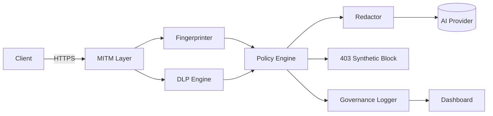

# Shadow AI Discovery & Governance Proxy (Synthetic Demo)

Educational, privacy-preserving proxy that simulates discovery, inspection, and governance of outbound AI traffic. All data is **synthetic**; no real credentials or user prompts are captured.

## Repository Tree
```
proxy/               # MITM layer, fingerprinting, DLP, redaction, policy, logging
dashboard/           # React + Vite governance UI (synthetic live feed)
tests/               # Synthetic pytest suite
deploy/helm/         # Optional Helm scaffold for sidecar/egress
docs/                # API reference and supporting docs
ARCHITECTURE.md      # Design and data flow
README.md            # This file
LICENSE              # MIT
CONTRIBUTING.md
CODE_OF_CONDUCT.md
SECURITY.md
requirements.txt
```

## Architecture (Mermaid)


## Components
- **MITM Layer** (`proxy/mitm_layer.py`): synthetic root CA, proxy.py integration, handshake logging.
- **Fingerprinter** (`proxy/fingerprinter.py`): domain/path/header/TLS heuristics for AI provider classification.
- **DLP Engine** (`proxy/dlp_engine.py`): regex + entropy + optional spaCy NER for PII/secret detection.
- **Policy Engine** (`proxy/policy_engine.py`): rules (no PII, redact secrets, block high-risk, whitelist external LLMs, safe-mode rewrite).
- **Redactor** (`proxy/redactor.py`): redact/mask/rewrite/block with consistent tokens.
- **Governance Logger** (`proxy/governance_logger.py`): JSONL + CSV event logging.
- **Dashboard** (`dashboard/`): React UI with synthetic live feed (heatmap, violations, logs).
- **Tests** (`tests/`): synthetic coverage for DLP, fingerprinting, and policy/redaction flow.

## Setup
```bash
python -m venv .venv
source .venv/bin/activate
pip install -r requirements.txt
```
Optional spaCy support: `python -m spacy download en_core_web_sm`

## Running (Synthetic Demo)
```bash
python -m proxy.main --demo
```
Emits governance events for sample synthetic prompts.

## Running (Lab MITM — synthetic only)
```bash
python -m proxy.main --mitm --listen 0.0.0.0:8899
```
Trust the generated CA **only** in isolated test clients. No production use.

## Dashboard
```bash
cd dashboard
npm install
npm run dev
```
Opens a synthetic live feed of policy decisions; wire to real WebSocket events if integrating.

## Tests
```bash
export PYTHONPATH=.
pytest tests
```
All tests use synthetic payloads only.

## Linting & formatting
```bash
pip install -r dev-requirements.txt
ruff check proxy tests
black --check proxy tests
isort --check-only proxy tests
```

## CI
- GitHub Actions (`.github/workflows/ci.yml`) runs ruff/black/isort/pytest on Python 3.10 & 3.11 and builds the dashboard on every push/PR.

## Make targets
Common workflows:
```bash
make install          # runtime deps
make install-dev      # + dev deps (ruff/black/isort)
make lint             # ruff + black --check + isort --check
make format           # auto-fix with ruff/black/isort
make test             # pytest
make demo             # synthetic demo run
make mitm             # lab-only MITM mode
make dashboard        # start dashboard dev server
```

## Policies (default)
- No outbound PII.
- Redact secrets; block high-secret risk.
- Block external LLMs unless whitelisted.
- Safe-mode rewrite for jailbreak-like prompts.

## Additional Docs
- Architecture: `ARCHITECTURE.md`
- API/Interfaces: `docs/API.md`
- Helm scaffold: `deploy/helm/values.yaml`

## Safety & Compliance
- Synthetic data only; no real credentials.
- MITM features are for controlled labs; never use on real users.
- Logs stored locally (JSONL/CSV).


